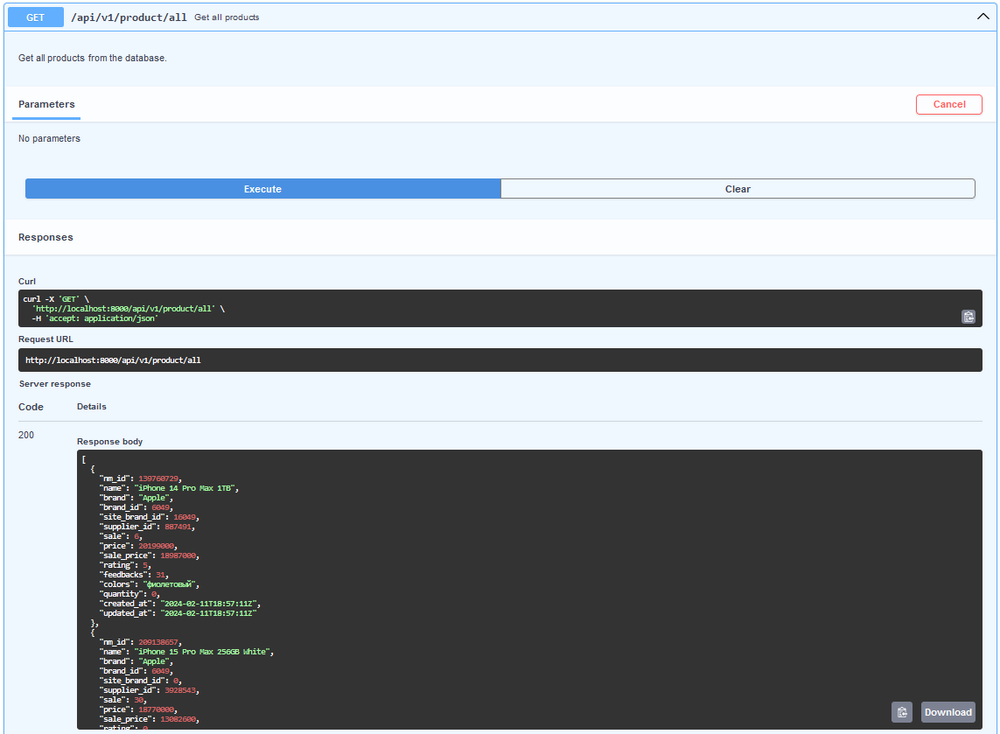
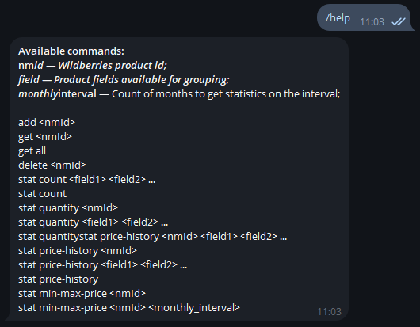
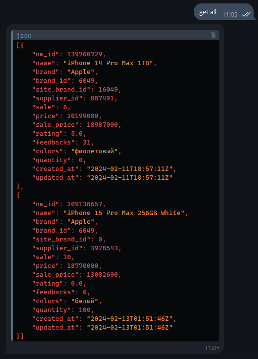

# WbDataService

## Launching (locally)

Clone the repository.
```shell
git clone https://github.com/egorov-m/wb-data-service.git
```

Create an .env file for the environment variables.
```shell
toucch .env
```

```
TELEGRAM_BOT_TOKEN = <token>
```

Build and launching containers.
```shell
docker compose up -d
```

Three containers are running: the Postgres database, the main REST service, and a telegram bot service **running via pooling**.

wb_data_service: http://localhost:8000

**Launching telegram bot using Webhook.**

To do this, it is necessary to additionally specify environment variables in .env. You can use [Ngrok](https://ngrok.com/) to run it locally.

```
TELEGRAM_BOT_MODE = webhook
TELEGRAM_BOT_WEBHOOK_URL = https://<your_domain>/webhook
```

In this case, three containers will also be launched. wb_data_tg_bot - service that processes data from telegram.

wb_data_service: http://localhost:8000
wb_data_tg_bot: http://localhost:8005

## Usage

### API

Use REST API of the main service providing the data. Swagger Docs: http://localhost:8000/docs, all supported endpoints with their descriptions can be found there.

### Telegram Bot

Getting data through a Telegram bot. **Commands available:**

- display a list of available commands:
```shell
/help
```
- add a new product to the database from Wildberries by its ID:
```shell
add <nm_id>
```
- get the product from the database by its identifier:
```shell
get <nm_id>
```
- get all products created in the database:
```shell
get all
```
- delete a product from the database by its identifier:
```shell
delete <nm_id>
```
- statistics, count of products in the database with grouping by specified fields:
```shell
stat count <field_1> <field_2> ...
```
- statistics, count of products in the database:
```shell
stat count
```
- statistics, count of products in stock for the specified product:
```shell
stat quantity <nm_id>
```
- statistics, count of products in stock with grouping by fields:
```shell
stat quantity <field_1> <field_2> ...
```
- statistics, count of products in stock, among all products in the database:
```shell
stat quantity
```
-  statistics, price history by category, like the specified product:
```shell
stat price-history <nm_id> <field_1> <field_2> ...
```
- statistics, price history of the specified product:
```shell
stat price-history <nm_id>
```
- statistics, price history by product category:
```shell
stat price-history <field_1> <field_2> ...
```
- statistics, price history for all products in the database:
```shell
stat price-history
```
- statistics, minimum maximum price of products for the last 6 months:
```shell
stat min-max-price <nm_id>
```
- statistics, minimum maximum price for the product for the specified count of months:
```shell
stat min-max-price <nm_id> <monthly_interval>
```

## Examples




